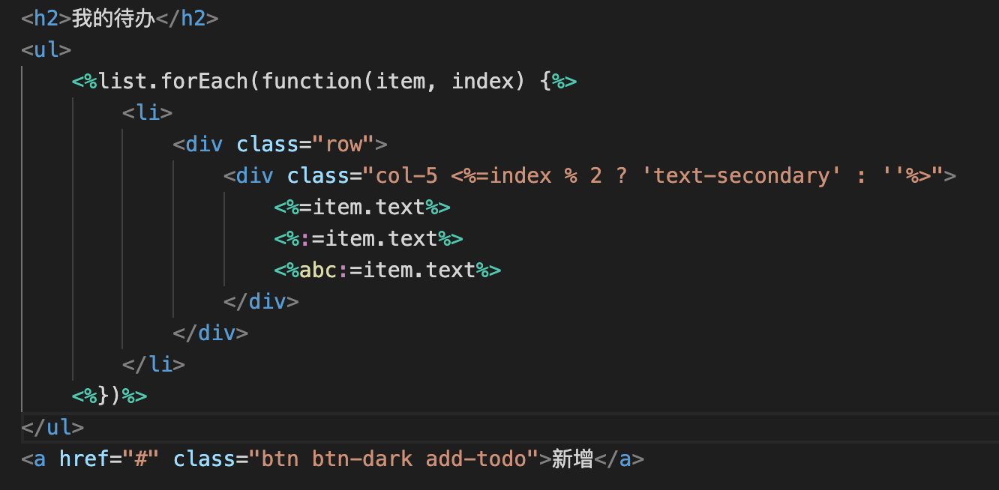

# [template-vscode](https://github.com/yanhaijing/template-vscode)

[template.js](https://github.com/yanhaijing/template.js) plugin for vscode, [click here](https://marketplace.visualstudio.com/items?itemName=yanhaijing1234.templatejs) to install

## Features

- Syntax highlight

Support syntax highlight for template.js

Source code example

```
<h2>我的待办</h2>
<ul>
    <%list.forEach(function(item, index) {%>
        <li>
            <div class="row">
                <div class="col-5 <%=index % 2 ? 'text-secondary' : ''%>">
                    <%=item.text%>
                    <%:=item.text%>
                    <%abc:=item.text%>
                </div>
            </div>
        </li>
    <%})%>
</ul>
<a href="#" class="btn btn-dark add-todo">新增</a>
```

Highlighting effect



## CHANGELOG
[CHANGELOG.md](https://github.com/yanhaijing/template-vscode/blob/master/CHANGELOG.md)

## TODO
[TODO.md](https://github.com/yanhaijing/template-vscode/blob/master/TODO.md)

## Contributor guide
开发时，直接运行当前项目，即可打开一个新编辑器，新编辑器里面会自动加载当前插件

How to publish, to install vsce

```bash
npm install -g vsce
```

Publish to vscode plugin store

```bash
vsce login # 首次需要登录
vsce publish # 发布插件
vsce publish [major|minor|patch|2.0.1] # 发布插件

vsce package # 打包插件，生成.vsix包，可被vscode直接安装
```

## Reference

- [vscode插件开发](https://liiked.github.io/VS-Code-Extension-Doc-ZH/#/)